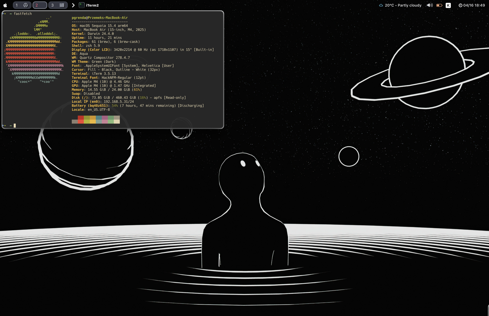

# MY MAC DOTFILES



## Quick Setup

```bash
# Install Homebrew
/bin/bash -c "$(curl -fsSL https://raw.githubusercontent.com/Homebrew/install/HEAD/install.sh)"

# Install tools
brew install nikitabobko/tap/aerospace sketchybar
brew install --cask karabiner-elements

# Start sketchybar
brew services start sketchybar
```

## Tools

### Aerospace
Tiling window manager for macOS with BSP layouts. Makes window management keyboard-driven and efficient.

### Sketchybar
Customizable status bar replacement. Shows system info and integrates with Aerospace for workspace indicators.

### Karabiner-Elements
Keyboard customizer for remapping keys and creating complex modifications.

#### Home Row Mods
Uses home row keys (ASDF/JKL;) as modifier keys when held down, while functioning as normal letter keys when tapped. This allows accessing modifiers without moving hands from the home row position:
- A/; = Shift
- S/L = Control
- D/K = Command
- F/J = Option
