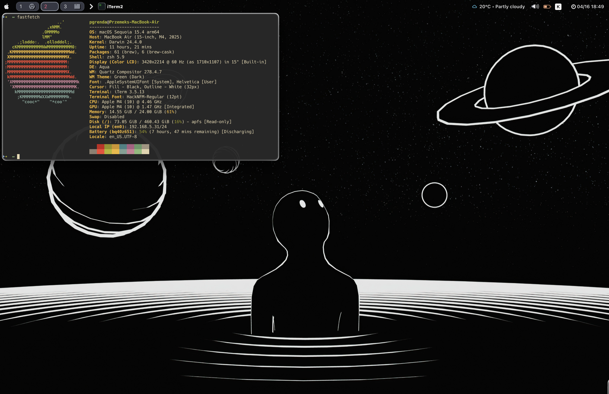

# MY MAC DOTFILES



Managed with [yadm](https://yadm.io/).

## Quick Setup

```bash
# Install Homebrew
/bin/bash -c "$(curl -fsSL https://raw.githubusercontent.com/Homebrew/install/HEAD/install.sh)"

# Install yadm and clone dotfiles
brew install yadm
yadm clone git@github.com:pegre94/dotfiles-mac.git

# Install tools
brew install nikitabobko/tap/aerospace sketchybar neovim wezterm starship
brew install zoxide fzf fnm direnv pyenv atuin bat dust fd ripgrep
brew install --cask karabiner-elements

# Start sketchybar
brew services start sketchybar
```

## What's Included

### Window Management & UI
- **[Aerospace](https://github.com/nikitabobko/AeroSpace)** — Tiling window manager with BSP layouts
- **[Sketchybar](https://github.com/FelixKratz/SketchyBar)** — Customizable status bar with Aerospace workspace indicators
- **[Karabiner-Elements](https://karabiner-elements.pqrs.org/)** — Keyboard remapping with home row mods

### Editor
- **[Neovim](https://neovim.io/)** — Configured with lazy.nvim, LSP, Telescope, Treesitter, and custom keymaps

### Terminal & Shell
- **[WezTerm](https://wezfurlong.org/wezterm/)** — GPU-accelerated terminal emulator
- **[Zsh](https://www.zsh.org/)** — Shell with Oh My Zsh, zsh-vi-mode, syntax highlighting, autosuggestions
- **[Starship](https://starship.rs/)** — Fast cross-shell prompt

### CLI Tools (referenced in .zshrc)
- **[atuin](https://atuin.sh/)** — Shell history sync
- **[zoxide](https://github.com/ajeetdsouza/zoxide)** — Smarter cd
- **[fzf](https://github.com/junegunn/fzf)** — Fuzzy finder
- **[bat](https://github.com/sharkdp/bat)** — cat replacement
- **[dust](https://github.com/bootandy/dust)** — du replacement

## Karabiner Home Row Mods

Uses home row keys (ASDF/JKL;) as modifier keys when held down, while functioning as normal letter keys when tapped:
- A/; = Shift
- S/L = Control
- D/K = Command
- F/J = Option
